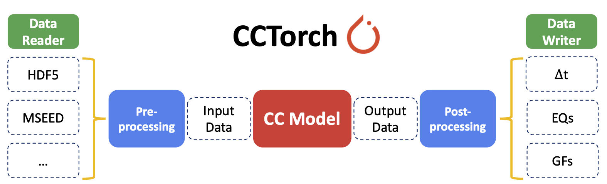

# [CCTorch: Cross-Correlation using Pytorch](https://ai4eps.github.io/CCTorch)



## Single GPU
python run.py

- Example for ambient noise
```
python run.py --data-list1=tests/data_am1.txt --data-path=tests --dt=0.04 --maxlag=30  --mode=AM --batch-size=200
```

## Multi GPUs (e.g., using 8 GPUs)
```
torchrun --standalone --nproc_per_node=8 run.py
```

- Example for mammoth south
```
torchrun --standalone --nproc_per_node=4 \
        run.py --generate-pair --auto-xcor --reduce-t --mccc --channel-shift=0 \
        --path-data=/kuafu/jxli/Data/DASEventData/mammoth_south/temp \
        --pair-list=/home/jxli/packages/CCTorch/tests/pair_mammoth_ccfm_test.txt \
        --path-xcor-data=/net/jin/ssd-tmp-nobak2/jxli/DASEventData/mammoth_south/temp_xcor_ccfm/xcor_data \
        --path-xcor-pick=/net/jin/ssd-tmp-nobak2/jxli/DASEventData/mammoth_south/temp_xcor_ccfm/xcor_pick \
        --path-xcor-matrix=/net/jin/ssd-tmp-nobak2/jxli/DASEventData/mammoth_south/temp_xcor_ccfm/xcor_matrix \
        --path-dasinfo=/kuafu/EventData/Mammoth_south/das_info.csv
```

## Multi Nodes using Slurm (e.g., using 2 nodes)
```
sbatch --nodes=2 --ntasks=2 sbatch_run.sh 
```
